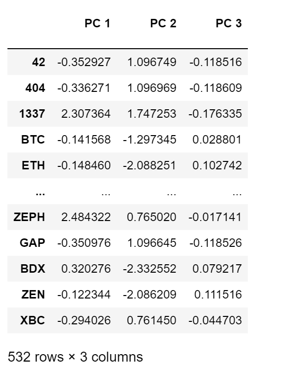
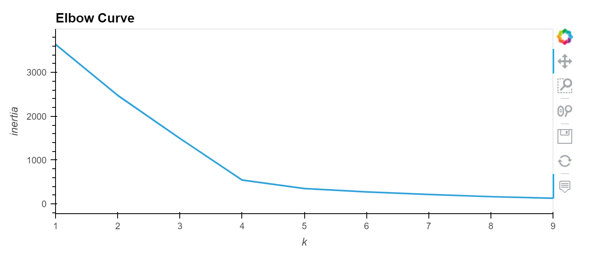
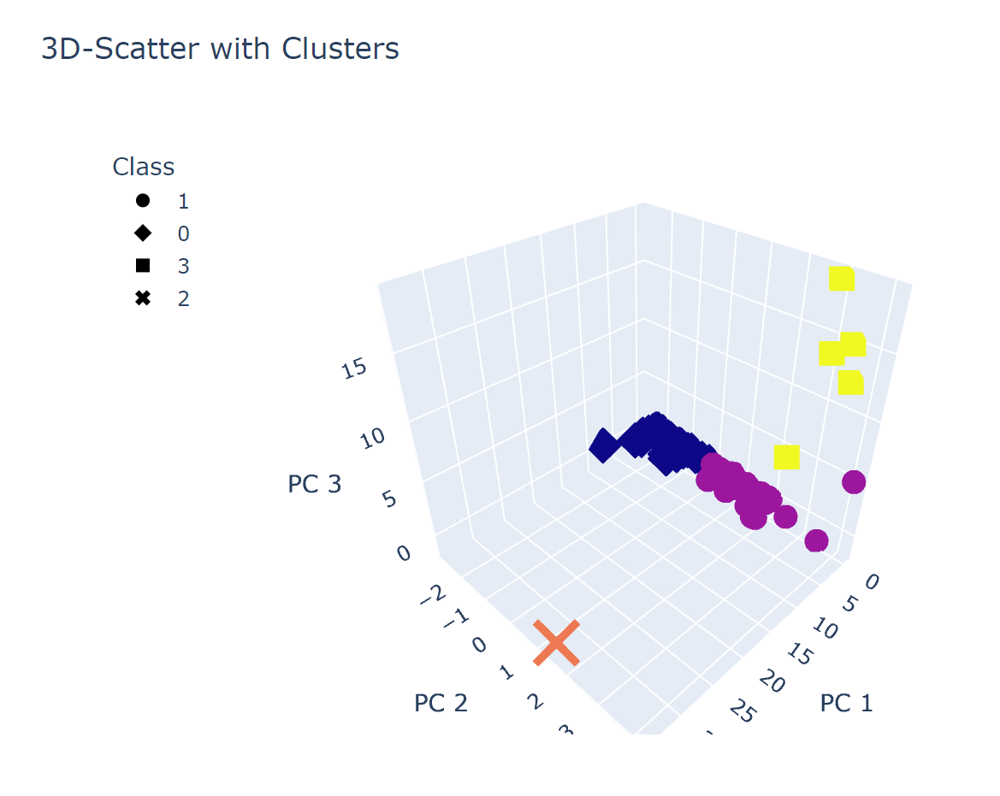
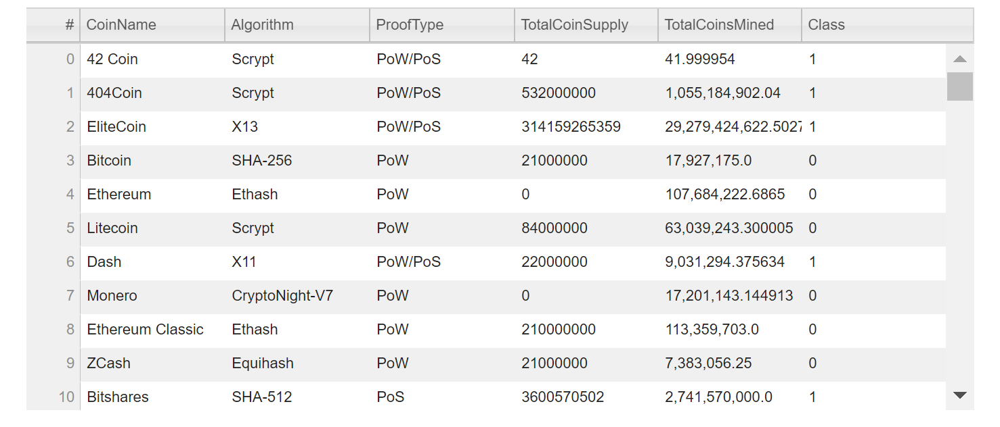
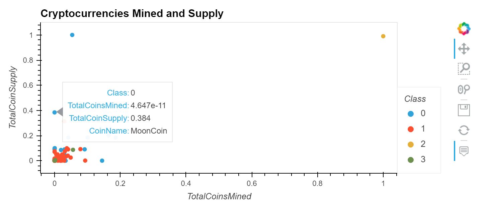

# Cryptocurrencies
## Overview of Cryptocurrencies
Cryptocurrencies Analysis project uses Unsupervised Machine Learning technique to analyze cryptocurrencies dataset. Through unsupervised machine learning, we use K-means model, Elbow Curve, and principal component analysis (PCA) to process dataset in order to speed up visualizing the results. Our goal is to reduce data dimensions, plot clustering crytocurrencies, and create a report to predict new investment in the trading market.

## Results
- Preprocessing the Data for PCA
  - Clean dataset: set index, rename columns, remove unrelated columns, drop null value data, filter data with Coins Mined.
  - Convert variables for text features
  - Scaling features from dataset
- Reducing Data Dimensions Using PCA
  - Reduce dimension to three principla components
  - Store PCA data
 
    
    
- Clustering Crytocurrencies Using K-Means
  - Create Elbow Curve to define the best K. As following curve shows, we determine the K=4.
    
    
    
  - Create K-Means model and make predictions
    
- Visualizing Results
  - Plot 3D-scatter with PCA data and clusters

  
  
  - Table shows tradable cryptocurrencies
    
    
  - Plot scatter shows the clusters for Coin Mined and Supply
    

## Summary
According to the results, we have successfully building Unsupervised Machine Learning models to predict and visulize our findings. We use Principal Component Analysis model to speed up machine learning algorithm by extracting features. Elbow Curve helps us to find optimize K-Means to better visualize our 2D and 3D clusters. In the future, we might consider to find a patterns in grouping data.   

